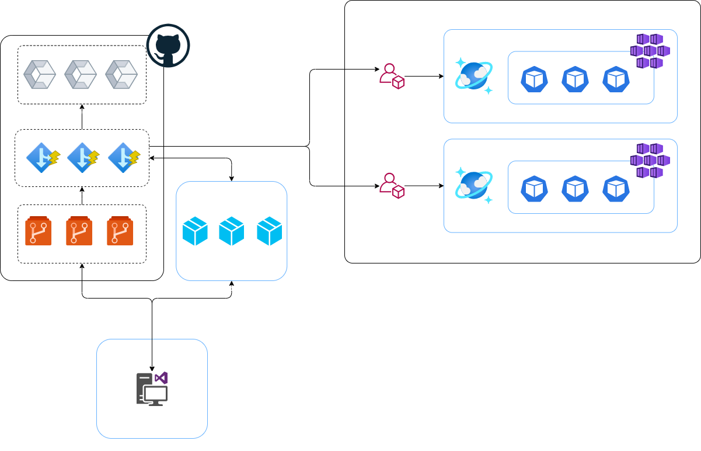
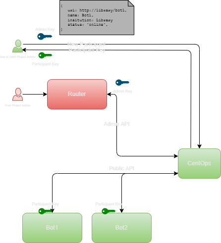

# Security Architecture

The architecture for **Buerokratt**s projects DMR and CentOps is entirely Kubernetes based.  For the MVP we will be using the Azure Kubernetes Service (AKS).

GitHub hold source code for the various components being built and will also host the CI/CD pipelines via GitHub Actions.



## Development Environment

Whilst the code is still on a developer's machine there are numerous opportunities to avoid and resolve security issues which may arise.

### Development Language Best Practice

Many tools exist which can enforce best practice on the code developed within a project.  These take the form of simple warnings displayed to the developer for common issues with code.  The developer then needs to resolve the issue or add an exception to the codebase.  Exceptions to best practice would be examined in code review and verified before the code is committed.

Many 3rd party tools exist which generate warnings in the developer's IDE for the infractions as they are discovered.

[SonarQube](https://www.sonarqube.org/) is a common source scanning tool and will warn about many features of a project's source code 'health' (dependencies included) and supports a number of languages.

.NET (use by this project at time of writing) has code analysis tools, these should be enabled on all projects.

Other languages have 'linting' tools which should be considered when onboarding a new language for this project.

### Dependency Health

#### .NET Packages

.NET Core references published open source functionality via NuGet Packages.  These packages may have published security issues, Common Vulnerabilities and Exposures (CVE) or GitHub Security Advisory (GHSA) which will require investigation and replacement by the development team to ensure executing code has the best possible security posture.

Tools like GitHub's [Dependabot](https://docs.github.com/en/code-security/dependabot) and [SonarQube](https://www.sonarqube.org/) have the capability to warn developers when these vulnerabilities are discovered.  
Even the .NET command line tool provides a basic view of dependency issues:

```cmd
dotnet list package --vulnerable --include-transitive
```

This [tooling](https://devblogs.microsoft.com/nuget/how-to-scan-nuget-packages-for-security-vulnerabilities/) is very basic however.

At a minimum tooling should be used to warn developers of issues would run in the build pipeline.  Ideally, developers are notified as soon as vulnerabilities are discovered and changes can be made even for components which aren't in active development.

#### Password scanning

All code repos in the Buerokratt platform are public on GitHub.  This means that secrets should be carefully segregated from code.  

In order to prevent developers committing secrets to public repos this project should implement password scanning which would run before changes are committed.

This can be done with a Git commit hook and is documented [here](https://github.com/wbreza/pre-commit-hooks/tree/main/detect-secrets)

> See the CentOps repo for an example of this setup.  This should be applied to all repos.

## Build Artefacts

This project aims to package all shipping code in Docker Containers, therefore to remain as secure as possible the project will need to validate they are free of known vulnerabilities.

### Containers

Docker Containers most commonly use base images which contain various components which themselves may have security vulnerabilities.  Known CVEs may exist for components within these images which may expose vulnerabilities aside from the code and dependencies directly shipped by this project.

Tools exist to scan containers for vulnerabilities.  One such tool is, Container Scan which can be run as part of the CI pipeline.

[Container Scan](https://github.com/marketplace/actions/container-image-scan)

Other container scanning technologies exist if this is found to be unsuitable.

Some consideration should be given to containers which are in production when vulnerabilities are discovered.  This may mean rescanning containers on a regular basis and raising alerts if security issues are discovered.

#### Reference Container Image Digests

To ensure precise versions of images are used throughout, calculated SHA256 digests can be used.

This applies to base images used to build containers created by this project:

e.g.:

```Dockerfile
FROM mcr.microsoft.com/dotnet/sdk@sha256:230aaa417fa4e08c1bc601ecd7b95fd7e20c3dfbb7360868d8d1a9de6513380c

...
```

SHA256 digests can also be used to reference Buerokratt produced containers when they are executed within Kubernetes.

SHA256 digests can be calculated during the build and recorded during the container publishing phase.

> Base image digests can be obtained from Docker Hub or from the local development machine's image cache.

```bash
docker images --digests
```

## Kubernetes

### Keep up with released versions of Kubernetes

AKS regularly make available updated versions of Kubernetes.  These contain new features, but most importantly for this document, security patches.

Whilst in operation - these updates will need to be evaluated an applied.

Other Kubernetes implementations will also need to be regularly patched and maintained.

### Don't run containers as root

Best practice to avoid 'Container Escape' is to not run the container from a root user account.

For the purposes of this project - that would mean creating a low privileged user.

```Dockerfile
...
RUN adduser \
  --disabled-password \
  --home /app \
  --gecos '' app \
  && chown -R app /app
USER app
...
```

### Run in a non-default namespace

Kubernetes Namespaces are separate from one another although they can communicate with services in other namespaces.   Namespaces offer a way to partition services and make them easier to manage.  

RBAC can be applied at the namespace level and will give admins more granularity and control over the services deployed to namespaces under their control.

For the purposes of this project - DMR and CentOps should reside in their own namespaces ('byk-dmr' and 'byk-centops', for instance) .  Hosted bots *could* reside in a shared 'bots' namespace as they may have similar access patterns and permissions (unless hosted bots have special security considerations)  

### Specify memory and CPU quotas

In order to prevent containers affecting other pods in the cluster it's often recommended to specify CPU usage and memory limits.  This can be done in the helm chart.

```yaml
...
resources:
  limits:
    cpu: 100m
    memory: 128Mi
  requests:
    cpu: 100m
    memory: 128Mi
...
```

The process of determining sensible limits can be a tricky one, however.  K8s will terminate the running pod which has gone beyond it's limits, so these values should be carefully chosen.  (Note. Keep in mind these limits/request values and their impact on autoscaling.)

### Specify 'Read Only' access for containers where possible

```yaml
  containers:
  - name: <container name>
    image: <image>
    securityContext:
      readOnlyRootFilesystem: true
```

> We may need to experiment with this one to ensure .NET containers can be run read only.

### Use tooling to validate Helm Charts for security issues.

[Checkov](https://www.checkov.io/) is a tool which can scan Helm charts for misconfigurations and generate warnings which can trigger failures in the CI infrastructure pipeline.

## Deployed Infrastructure

At time of writing the Buerokratt project will deploy it's resources to Azure using Terraform.

### Complete Separation Between Development and Production Environments

Each deployed environment should have separate resources from one another.  This goes back as far as the Service Principal used to deploy these environments.  (This project uses Service Principal identities to perform infrastructure and application deployment via Terraform).  

No resources should be shared across environments.  e.g. No resources in the 'Dev' environment should be used in the 'Integration' environment.

### Secret Management

All secrets used within this project should be stored using secure stored with deployment Service Principals (for performing deployments) and Service Administrators.

Secrets pertain to data connection strings, access keys or credentials.

GitHub Secrets and Azure Key Vault both offer this capability and can be selected based on the use case.

### vLANs for Resource Protection

Where possible - we can ensure that traffic remains 'hidden' from the internet by creating Virtual Lans.  This project intends to use Cosmos DB as a datastore for the CentOps Service.  

Communication between AKS and CosmosDB can be performed across a vLAN for best protection for this traffic.

### Mutual TLS

Service to service communication within Kubernetes should be protected with mTLS.  This ensures that traffic within the cluster is encrypted, but both client and service authenticate with one another. (See [Mutual TLS](https://en.wikipedia.org/wiki/Mutual_authentication#mTLS))

### IP Filtering on Public Endpoints

Lock down IPs to specific endpoints which are allowed access to particular APIs.

This project will be exposing 'public' and 'private' endpoints from the same clusters.

We should consider opportunities to only allowing access to private endpoints from particular IP addresses. e.g. The Admin API for CentOps can only be called from the network the CentOps Administrator will access it from.

## Security in Operation

### Communication

* HTTPS Everywhere.
* TLS 1.2 at a bare minimum.
* Strict CORS policies where applicable.

### Versioning

Developed Components should identify the version of the code they represent.  This allows participants in the Buerokratt system to gate interaction to other components based on their version.  On API endpoints this might be a simple X-Byk-CentOps-Version header that ties that component to a particular build.


### Service Telemetry and Monitoring

Successful and unsuccessful API access is something which should be monitored closely.  Unauthenticated or poorly formatted requests are a signal that malicious users are attempting to access and possibly exploit the system.

Metrics to capture:

* Logins (Unsuccessful and Successful).
* Resource access (Unsuccessful and Successful).
* Exceptions and failures.
* Service start-up and restart.

Audit Access:

* Admin APIs
* Public APIs

Anomalous usage patterns should create alerts for the attention of service owners.

### Authentication and Authorisation for CentOps



For the purposes of this project, we're implementing API keys for the CentOps Admin API and Public APIs.

The Private API will be called by CentOps Administrators who will be responsible for on-boarding new participants during the onboarding process.

#### Authenticating with the CentOps Private Admin API

1. Terraform can generate an Admin API Key on deployment or it can be explicitly provided as a GitHub/Azure KeyVault secret and add it to the CentOps configuration.  Only holders of this API Key will be able to call the Admin API.

> Note. We're expecting Ruuter to act as a proxy for this API post project. In this scenario, Ruuter would need to provide the API Key to contact this endpoint when forwarding traffic.

#### On Boarding a New Participant and Authenticating with the Public API

The onboarding process is a crucial part of obtaining an API key.  The following describes the process which we aim to implement as part of this project.

1. A Prospective Chatbot Participant will requests to join the Buerokratt System via email or using some other 'non-automated' mechanisim.
  They will need to provide the Endpoint the participant will be hosted on, its Institution and its Name.

2. The CentOps Admin creates the requested participant using the CentOps private Admin API.  

   ``` json
   {
    endpoint: "http://bot1:8080",
    name: "bot1",
    institutionId "e98fb20d-e3fa-45c5-85a2-d14ef33bf280",
    status: "Online",
    type: "Chatbot"
   }
   ```

3. This generates an API key which is securely provided to the Participant by the CentOps admin in a non-automated fashion.

4. The Participant can add the API key to the Chatbot configuration which will allow the chatbot, in this case, to contact the CentOps Public API.  This key will not allow communication with the Private, by design.
